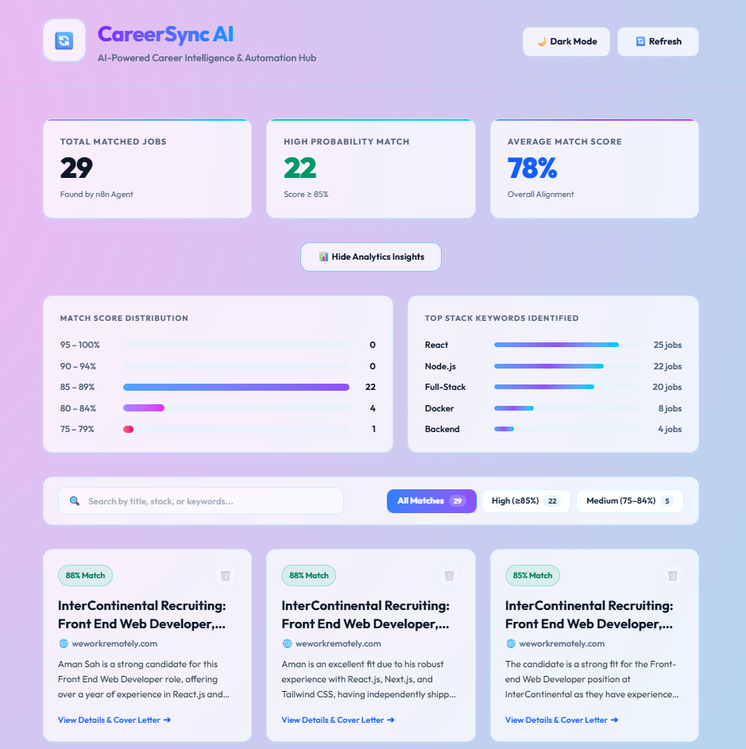
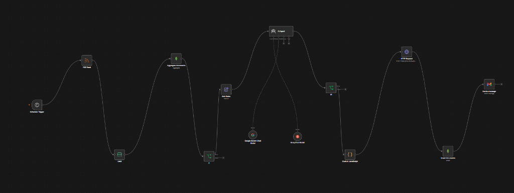
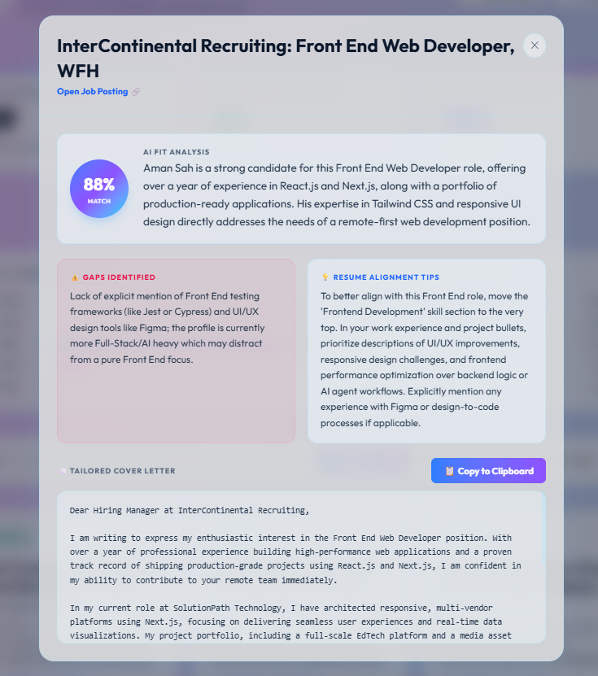

<div align="center">

# 🔄 CareerSync AI

### AI-Powered Career Intelligence & Automation Hub

*Automatically finds, scores, and analyses job listings against your resume — powered by n8n, Groq AI, Google Gemini, and a React dashboard.*

[](https://react.dev)
[](https://vite.dev)
[](https://tailwindcss.com)
[](https://expressjs.com)
[](https://mongodb.com/atlas)
[](https://n8n.io)

</div>

---

## 📸 Overview

CareerSync AI is a full-stack job-matching automation system. An **n8n workflow** runs on a schedule, scrapes RSS job feeds, uses **Groq AI** and **Google Gemini** to score each job against your resume, stores the results in **MongoDB Atlas**, and notifies you on **WhatsApp**. A **React dashboard** lets you browse, filter, and analyse all matched jobs — and copy tailored cover letters with one click.

### 🖥️ Dashboard Interface
<p align="center">
  
</p>

### 🤖 n8n Automation Workflow Canvas
<p align="center">
  
</p>

### 💡 Detailed AI Fit Analysis & Tailored Cover Letter Modal
<p align="center">
  
</p>

---

## ✨ Features

### 🤖 n8n Automation Pipeline
- **Scheduled job scraping** from RSS feeds on a recurring schedule
- **Duplicate detection** — skips already-processed jobs via MongoDB lookup
- **AI match scoring** using Groq Chat (LLaMA) and Google Gemini
- **Tailored cover letter generation** for every job
- **Gap analysis** — identifies missing skills between your resume and the job
- **Resume alignment tips** — actionable improvements for each role
- **WhatsApp notifications** when high-match jobs are found
- **Gmail email notifications** with full fit summaries, gaps, and resume tips
- **HTTP Request node** → `POST /api/jobs` to save results to MongoDB

### 🖥️ React Dashboard (Frontend)
- **Live job cards grid** — sorted by match score descending
- **Real-time search** — filter by title, tech stack, fit summary, or keywords
- **Score filter tabs** — All / High (≥85%) / Medium (75–84%)
- **Statistics panel** — Total matched, High probability count, Average score
- **Analytics drawer** — Score distribution bar charts + Top tech stack keywords
- **Job detail modal** — Full AI fit analysis, gaps, tips, and cover letter
- **Copy to clipboard** — One-click cover letter copy
- **Delete job** — Remove a listing from the dashboard
- **Dark / Light mode toggle** — with `localStorage` persistence and system preference detection
- **Glassmorphism UI** — Translucent sky-blue/sapphire glass cards with premium animations
- **Fully responsive** — Mobile, tablet, and desktop layouts

---

## 🗂️ Project Structure

```
careersync-ai/
│
├── 📄 package.json          ← Root scripts (run client + server)
├── 📄 .gitignore            ← Covers all node_modules & .env files
├── 📄 README.md             ← This file
│
├── 📂 client/               ─── React Frontend ───────────────────
│   ├── 📂 src/
│   │   ├── App.jsx          ← Entire dashboard UI & logic (498 lines)
│   │   ├── index.css        ← Tailwind v4 @theme tokens + base styles
│   │   ├── App.css          ← (Empty — all styles via utility classes)
│   │   └── main.jsx         ← React 19 entry point
│   ├── 📄 .env              ← VITE_API_URL (not committed to Git)
│   ├── 📄 .env.example      ← Safe template (committed to Git)
│   ├── 📄 index.html        ← HTML shell with emoji favicon
│   ├── 📄 vite.config.js    ← Vite + @tailwindcss/vite + React plugin
│   └── 📄 package.json      ← Frontend dependencies
│
└── 📂 server/               ─── Express Backend API ─────────────
    ├── index.js             ← REST API server (GET/POST/DELETE)
    ├── test_db.js           ← MongoDB connection diagnostics script
    ├── 📄 .env              ← MONGODB_URI, PORT etc. (not committed)
    ├── 📄 .env.example      ← Safe template (committed to Git)
    └── 📄 package.json      ← Backend dependencies
```

---

## 🛠️ Tech Stack

### Frontend (`client/`)
| Technology | Version | Purpose |
|---|---|---|
| **React** | 19 | UI framework |
| **Vite** | 8 | Build tool & dev server |
| **Tailwind CSS** | v4 | Utility-first styling |
| **@tailwindcss/vite** | 4.3 | Native Vite Tailwind integration |
| **Outfit / JetBrains Mono** | Google Fonts | Typography |

### Backend (`server/`)
| Technology | Version | Purpose |
|---|---|---|
| **Node.js** | ≥18 | Runtime |
| **Express** | 4 | REST API framework |
| **MongoDB Driver** | 6 | Database client |
| **dotenv** | 16 | Environment variable loader |
| **cors** | 2 | Cross-Origin Resource Sharing |

### Automation & AI
| Service | Role |
|---|---|
| **n8n** | Workflow automation engine |
| **Groq AI (LLaMA)** | Primary job scoring & cover letter LLM |
| **Google Gemini** | Secondary analysis model |
| **MongoDB Atlas** | Cloud database for job storage |
| **WhatsApp Business API** | Job match notifications |
| **Gmail OAuth2 API** | Detailed email digests and job analysis |

---

## ⚙️ Environment Variables

### Frontend — `client/.env`
```env
# Backend API base URL
VITE_API_URL=http://localhost:5000

# Production:
# VITE_API_URL=https://your-api.railway.app
```

### Backend — `server/.env`
```env
# Express server port
PORT=5000

# MongoDB Atlas connection string
# Get from: Atlas → Cluster → Connect → Drivers
MONGODB_URI=mongodb+srv://<username>:<password>@<cluster>.mongodb.net/?retryWrites=true&w=majority

# Database name
DB_NAME=PORTFOLIOODB

# Allowed frontend origin (for CORS)
FRONTEND_URL=http://localhost:5173
# Production: FRONTEND_URL=https://your-app.vercel.app
```

> ⚠️ **Never commit `.env` files to Git.** Use `.env.example` as the template.

---

## 🚀 Local Setup & Running

### Prerequisites
- Node.js ≥ 18
- MongoDB Atlas account (free tier works)
- npm

### Step 1 — Clone & Install

```bash
git clone https://github.com/YOUR_USERNAME/careersync-ai.git
cd careersync-ai

# Install all dependencies
npm install --prefix client
npm install --prefix server
```

### Step 2 — Configure Environment

```bash
# Frontend
cp client/.env.example client/.env
# Edit client/.env → set VITE_API_URL=http://localhost:5000

# Backend
cp server/.env.example server/.env
# Edit server/.env → add your MONGODB_URI and DB_NAME
```

### Step 3 — Start Backend Server

```bash
cd server
node index.js
```

Expected output:
```
🚀  CareerSync API running on port 5000
✅  Connected to MongoDB Atlas
   Frontend allowed: http://localhost:5173
   Database: PORTFOLIOODB
```

### Step 4 — Start Frontend Dev Server

```bash
cd client
npm run dev
```

Open: **http://localhost:5173** 🎉

---

## 🌐 API Reference

### Base URL
```
Local:      http://localhost:5000
Production: https://your-api.railway.app
```

### Endpoints

#### `GET /`
Health check — returns server status.
```json
{ "status": "ok", "service": "CareerSync AI API", "version": "1.0.0" }
```

#### `GET /api/jobs`
Returns all matched jobs sorted by `match_score` descending.
```json
[
  {
    "_id": "64f...",
    "title": "Senior Backend Engineer",
    "url": "https://example.com/job/123",
    "match_score": 92,
    "fit_summary": "Strong alignment with Node.js and MongoDB expertise...",
    "gaps": "No Kubernetes experience mentioned in resume.",
    "tailored_resume_tips": "Highlight your Docker experience and...",
    "cover_letter": "Dear Hiring Manager...",
    "created_at": "2026-06-25T03:00:00.000Z"
  }
]
```

#### `POST /api/jobs`
Saves a new matched job. Called automatically by the **n8n HTTP Request node**.

**Request Body:**
```json
{
  "title": "Senior Backend Engineer",
  "url": "https://example.com/job/123",
  "match_score": 92,
  "fit_summary": "Strong alignment with...",
  "gaps": "No Kubernetes experience...",
  "tailored_resume_tips": "Highlight your Docker...",
  "cover_letter": "Dear Hiring Manager..."
}
```

**Response `201`:**
```json
{ "success": true, "insertedId": "64f..." }
```

#### `DELETE /api/jobs/:id`
Deletes a job by MongoDB `_id`.

**Response `200`:**
```json
{ "success": true }
```

---

## 🤖 n8n Workflow Setup

### Workflow Flow
```
Schedule Trigger
    ↓
RSS Feed (job board feeds)
    ↓
Check MongoDB (duplicate detection)
    ↓
Edit Fields → Aggregate Documents
    ↓
AI Agent
  ├── Groq Chat Model (LLaMA)
  └── Google Gemini Chat Model
    ↓
Code in JavaScript (format output)
    ↓
HTTP Request → POST /api/jobs  ← saves to MongoDB via your API
    ↓
Insert Documents (MongoDB direct)
    ├─ Send a Message (WhatsApp notification)
    └─ Gmail (Detailed email notifications)
```

### HTTP Request Node Configuration

| Setting | Value |
|---|---|
| **Method** | `POST` |
| **URL** | `https://your-api.railway.app/api/jobs` |
| **Body Content Type** | `JSON` |
| **Specify Body** | `Using Fields Below` |

**Body Fields:**
| Name | Value |
|---|---|
| `title` | `{{ $json.title }}` |
| `url` | `{{ $json.url }}` |
| `match_score` | `{{ $json.match_score }}` |
| `fit_summary` | `{{ $json.fit_summary }}` |
| `gaps` | `{{ $json.gaps }}` |
| `tailored_resume_tips` | `{{ $json.tailored_resume_tips }}` |
| `cover_letter` | `{{ $json.cover_letter }}` |

> ⚠️ n8n Cloud blocks `localhost` — use a deployed public URL.

### 🔔 Notification Nodes Configuration

You can configure n8n to send real-time alerts to both **WhatsApp** and **Gmail** when high-match jobs are found.

#### 1. WhatsApp Notifications Setup
To send alerts directly to your phone, use either the native **WhatsApp Business Cloud API** node or the **Twilio** node in n8n.

*   **Credential Setup (WhatsApp Business Cloud API):**
    1.  Create a Meta Developer account and set up the WhatsApp Business Platform.
    2.  Obtain your **Temporary Access Token** (or Permanent System User Token) and **Phone Number ID**.
    3.  Create a new credential in n8n under **WhatsApp Business Cloud API** and input these details.
*   **Node Configuration:**
    *   **Resource:** `Message`
    *   **Operation:** `Send Text` (or `Send Template` if using WhatsApp Business Templates)
    *   **Recipient Phone Number:** Your phone number with country code (e.g., `+1234567890`)
    *   **Message:**
        ```text
        🚀 *CareerSync AI — High Match Job Found!*
        *Job:* {{ $json.title }}
        *Match Score:* {{ $json.match_score }}%
        *URL:* {{ $json.url }}
        *Fit Summary:* {{ $json.fit_summary }}
        ```

#### 2. Gmail Notifications Setup
To send detailed HTML digests to your inbox, use the native **Gmail** node.

*   **Credential Setup:**
    1.  Add a **Gmail OAuth2 API** credential in n8n.
    2.  Set up an OAuth Consent Screen and credentials in the Google Cloud Console to get a Client ID and Client Secret, or use n8n's OAuth credentials helper.
*   **Node Configuration:**
    *   **Resource:** `Message`
    *   **Operation:** `Send`
    *   **To:** `your.email@gmail.com`
    *   **Subject:** `[CareerSync AI] High Match: {{ $json.title }} ({{ $json.match_score }}%)`
    *   **Body Type:** `HTML`
    *   **Email Body:**
        ```html
        <h3>🚀 CareerSync AI Match Found!</h3>
        <p><strong>Job Title:</strong> {{ $json.title }}</p>
        <p><strong>Match Score:</strong> <span style="color:#059669;font-weight:bold;">{{ $json.match_score }}%</span></p>
        <hr />
        <h4>💡 Fit Summary</h4>
        <p>{{ $json.fit_summary }}</p>
        <h4>⚠️ Identified Gaps</h4>
        <p>{{ $json.gaps }}</p>
        <h4>📝 Resume Tips</h4>
        <p>{{ $json.tailored_resume_tips }}</p>
        <br />
        <a href="{{ $json.url }}" style="display:inline-block;background:#0284c7;color:#ffffff;padding:10px 20px;text-decoration:none;border-radius:6px;font-weight:bold;">Apply / View Posting</a>
        ```

---

## 🚢 Deployment

### Frontend → Vercel (Free)

1. Push `client/` to GitHub
2. Import on [vercel.com](https://vercel.com)
3. Set environment variable:
   ```
   VITE_API_URL = https://your-api.railway.app
   ```
4. Deploy ✅

### Backend → Railway (Free)

1. Push `server/` to GitHub
2. New Project on [railway.app](https://railway.app) → Deploy from GitHub
3. Set environment variables:
   ```
   MONGODB_URI   = mongodb+srv://...
   DB_NAME       = PORTFOLIOODB
   PORT          = 5000
   FRONTEND_URL  = https://your-app.vercel.app
   ```
4. Get public URL → update `VITE_API_URL` in Vercel ✅

### n8n → n8n Cloud

1. Export workflow JSON from local n8n
2. Sign up at [app.n8n.cloud](https://app.n8n.cloud)
3. Import workflow JSON
4. Re-add all credentials (Groq, Gemini, MongoDB, WhatsApp)
5. Update HTTP Request URL to your Railway backend
6. Activate workflow 🟢

### Deployment Cost Breakdown

| Service | Plan | Cost |
|---|---|---|
| Vercel (Frontend) | Hobby | **Free** |
| Railway (Backend) | Starter | **Free** ($5 credit/mo) |
| MongoDB Atlas | M0 Cluster | **Free** (512MB) |
| n8n Cloud | Trial / Starter | Free trial, then ~$20/mo |
| **Total (excluding n8n)** | | **$0/month** |

---

## 🧪 Testing MongoDB Connection

```bash
cd server
node test_db.js
```

This script lists all databases, collections, and sample documents from your Atlas cluster — useful for debugging connection issues.

---

## 🎨 Design System

| Element | Light Mode | Dark Mode |
|---|---|---|
| **Background** | Pastel pink → sky-blue radial gradient | Midnight sapphire radial gradient |
| **Cards** | `rgba(255,255,255,0.72)` glass | `rgba(18,27,61,0.6)` deep-sapphire glass |
| **Borders** | Sky-blue `rgba(168,229,253,0.45)` | Violet `rgba(139,92,246,0.18)` |
| **Hover borders** | Royal blue glow | Electric cyan glow |
| **Typography** | Deep ocean navy `#0c182b` | Crisp white `#f1f5f9` |
| **Font** | Outfit (Google Fonts) | Outfit (Google Fonts) |
| **Code font** | JetBrains Mono | JetBrains Mono |

---

## 📁 Key File Paths

```
C:\Users\aarya\.gemini\antigravity\scratch\careersync-ai\
├── client\src\App.jsx       ← Main UI (edit to customise dashboard)
├── client\src\index.css     ← Design tokens & theme (edit colours here)
├── client\.env              ← Set VITE_API_URL here
├── server\index.js          ← API routes (add new endpoints here)
└── server\.env              ← Set MONGODB_URI here
```

---

## 📄 License

MIT — free to use, modify, and deploy.

---

<div align="center">

Built with ❤️ using **React + n8n + Groq AI + MongoDB**

</div>
# full-stack-job-matching-automation-system.
